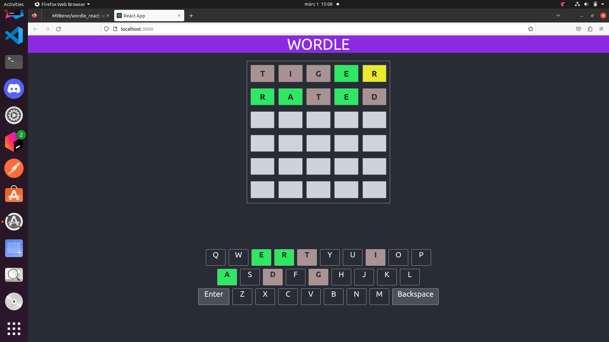

# wordle_react
A Wordle (word guessing) game web application.

### Pictures:

### Tech stack: 
- Javascript
- React
- Css
- (Html) + JSX

### Setup:

- Clone the repository:

  ~ git clone https://github.com/M9Bene/wordle_react.git
  
- Navigate to the project directory:
     
     ~ cd wordle_react/wordle_react
    
    ~ npm install

    ~ npm start
- This will start the app in development mode, which you can view in your web browser at http://localhost:3000.

### Things to improve on later:
- Make the website responsive.

